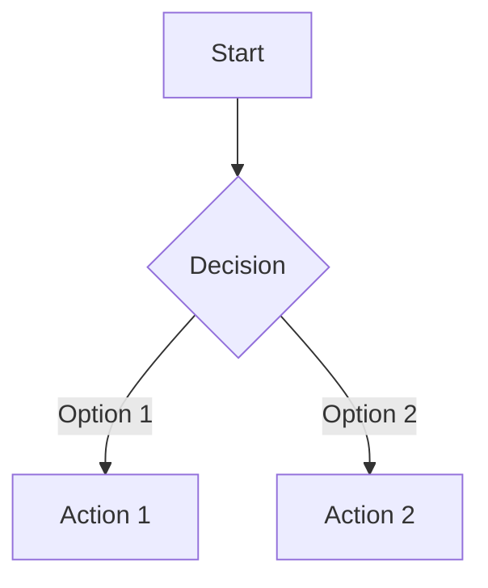


Builds domain authority through quality backlinks. Without external validation, rankings plateau regardless of content quality.


## Overview

<!-- Brief explanation of what this skill does and why it matters -->

## Target User

<!-- Who will use this skill? What role/function? -->

## Use Cases

<!-- List 3-5 specific scenarios where this skill applies -->

- 
- 
- 

## Success Metrics

<!-- How do we know the skill is working well? -->

- 
- 

## Deliverables

<!-- What outputs does this skill produce? -->

- 
- 

---

## Expert Sources

### Identified Experts

<!-- Top 3-5 experts in this field -->

| Expert | Known For | Key Resources |
|--------|-----------|---------------|
| | | [Link](#) |
| | | [Link](#) |
| | | [Link](#) |

### Expert Systems & Methods

<!-- Frameworks, methodologies, or systems these experts use -->

---

## Knowledge Base

### Best Practices

<!-- Core principles that guide this skill -->

1. 
2. 
3. 

### Frameworks

<!-- Decision frameworks, models, or structured approaches -->

### Glossary

<!-- Key terms and definitions -->

<dl>
<dt>Term</dt>
<dd>Definition</dd>
</dl>

### Compliance & Regulations

<!-- Relevant legal, platform, or industry requirements -->

- 

---

## Workflows

### Decision Tree

<!-- When to use which approach -->

### Consultation Phases

<!-- Stages when working with a client or stakeholder -->

1. **Discovery** — 
2. **Analysis** — 
3. **Recommendation** — 
4. **Implementation** — 
5. **Review** — 

---

## Outputs

### Templates

<!-- Reusable templates this skill produces -->

- [Template Name](#) — Description

### Reports

<!-- Standard reports or deliverables -->

- [Report Name](#) — Description

### Checklists

<!-- Quality control or process checklists -->

- [ ] Item 1
- [ ] Item 2

---

## Advanced

### Advanced Tactics

<!-- Techniques beyond the basics -->

### Anti-Patterns

<!-- Common mistakes to avoid -->

- ❌ 
- ❌ 

### Edge Cases

<!-- Unusual situations and how to handle them -->

---

## Calculations

<!-- Formulas, metrics, or calculations used -->

| Metric | Formula | Example |
|--------|---------|---------|
| | | |

---

## Triggers

<!-- When should this skill be activated? What signals indicate it's needed? -->

- 
- 

---

## Testing & Validation

### Test Cases

<!-- Scenarios to verify the skill works correctly -->

| Input | Expected Output | Status |
|-------|-----------------|--------|
| | | ⬜ |

### Known Gaps

<!-- Areas that need improvement -->

- 

---

## Related Skills

<!-- Links to complementary skills -->

- [Skill Name](/docs/skills-catalog/skill-slug/)

---

## Changelog

| Date | Change | Author |
|------|--------|--------|
| 2026-01-27 | Initial template created | |
