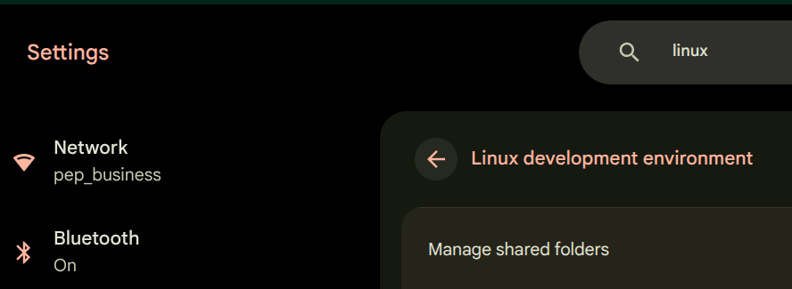

This document contains instructions on how to run hugo, and edit the workers.digitalcrunch.com website or if you want to create your own website.   This does not cover netlify setup, or cloudflare dns, as those are already setup for this website.

## Install Linux Developer
ChromeOS can run linux as a container, and it's connected together seamlessly.    ChromeOS is basically webbrowsing, but it allows for connections to linux and the google android ecosystem too.



## gh CLI Login

You need to authorize github before you can access your private repos.   LXC container passes code to browser, then authorizes forever based on code.   

```
sudo apt install -y gh
gh auth login
```
## Install Go

Hugo uses golang internally, so this is required as a prerequisite.

### Download & Unpack

```
wget https://go.dev/dl/go1.25.6.linux-amd64.tar.gz
sudo tar -C /usr/local/ -xzf go1.25.6.linux-amd64.tar.gz
```
### Setup Go in Path

```
echo 'export PATH=/usr/local/go/bin:$PATH' >> ~/.bashrc
echo 'export PATH=$PATH:$(/usr/local/go/bin/go env GOPATH)/bin' >> ~/.bashrc
source ~/.bashrc
```
## Install Hugo Extended

We want to match the same version of hugo on each machine so there are no conflicts.  That version is 0.147.8 Extended.

### Download & Install

```
wget https://github.com/gohugoio/hugo/releases/download/v0.147.8/hugo_extended_0.147.8_linux-amd64.deb
sudo apt install -y ./hugo_extended_0.147.8_linux-amd64.deb
```

## Clone Repo

The repo has all of the theme/css/docs/images and hugo files.   You do not install a new site with `hugo new site somesite` Instead, you clone it and start working.   This is the restore process too and takes only a few seconds

```
git clone https://github.com/rubysash/site.workers.digitalcrunch.git
```

## Start Hugo

Now that you've cloned the site, change the directory and begin the local hugo server like normal at http://localhost:1313

```
cd site.workers.digitalcrunch
hugo server
```

## Github Sync

Normally the workflow looks like this:

1. make edits
2. Verify they look good on localhost:1313
3. `git add -A`
4. `git commit -m "some note"`
5. `git push`
6. Verify build was successful in netlify.com project deployment
7. View it on `https://workers.digitalcrunch.com`

When working between machines, push on one, then do this on the other:

1. `git pull --ff-only`

Then proceed with the normal workflow, making sure to git push when you are done.   The build does not to deploy successfully, but you must commit so it can be pulled for use on another computer.

## vscodium

You can use anything to edit the markdown files.   On windows I use notepad++, or vscode.   Debian (the default chromebook linux version), has featherpad and vscodium.   

### Prerequisites

To prepare for the installs we need some pre-isntalls.
```
sudo apt update
sudo apt -y install curl ca-certificates gnupg apt-transport-https

```
### Keyring updates

Debian linux accesses repositories of files that are signed and it uses a keyring to verify that signing.   We need to update the keyring to allow installing from a non-default prerequisites

```
curl -fsSL https://gitlab.com/paulcarroty/vscodium-deb-rpm-repo/raw/master/pub.gpg \
  | gpg --dearmor \
  | sudo tee /usr/share/keyrings/vscodium-archive-keyring.gpg >/dev/null

echo "deb [signed-by=/usr/share/keyrings/vscodium-archive-keyring.gpg] https://download.vscodium.com/debs vscodium main" \
  | sudo tee /etc/apt/sources.list.d/vscodium.list >/dev/null
```

### Install codium

Now run the install.
```
sudo apt update
sudo apt -y install codium
```

### Use Codium

Simply type `codium` to start codium, the editor.   You can then right click and pin it on the taskbar so next time is easier to start it.

From the menu "open folder" and then Browse to the site.workers.digitalcrunch/content/ and you can begin editing files.